# SoybeanAdmin 项目架构文档

> 最后更新: 2026-03-05

## 项目愿景

SoybeanAdmin 是一个清新优雅的中后台管理系统模板，基于 Vue3、Vite7、TypeScript、NaiveUI 和 UnoCSS 构建。项目旨在提供开箱即用的后台管理解决方案，支持多种布局模式、主题定制、国际化等企业级特性。

## 架构总览

项目采用 Monorepo 架构，主应用位于 `src/` 目录，共享包位于 `packages/` 目录。核心架构遵循 Vue3 组合式 API + Pinia 状态管理 + Vue Router 路由管理的标准方案。

### 技术栈

| 分类 | 技术 | 版本 |
|------|------|------|
| 框架 | Vue | 3.5.27 |
| 构建工具 | Vite | 7.3.1 |
| 语言 | TypeScript | 5.9.3 |
| UI 组件库 | NaiveUI | 2.43.2 |
| 状态管理 | Pinia | 3.0.4 |
| 路由 | Vue Router | 4.6.4 |
| CSS 方案 | UnoCSS | 66.6.0 |
| 国际化 | Vue I18n | 11.2.8 |
| 图表 | ECharts | 6.0.0 |
| HTTP 客户端 | Axios | - |

## 模块结构图

```mermaid
graph TD
    A["SoybeanAdmin (根)"] --> B["src (主应用)"]
    A --> C["packages (共享包)"]
    A --> D["build (构建配置)"]

    B --> B1["components (组件)"]
    B --> B2["layouts (布局)"]
    B --> B3["views (页面)"]
    B --> B4["store (状态)"]
    B --> B5["router (路由)"]
    B --> B6["service (API)"]

    C --> C1["@sa/axios (请求封装)"]
    C --> C2["@sa/hooks (通用 Hooks)"]
    C --> C3["@sa/materials (UI 组件)"]
    C --> C4["@sa/utils (工具函数)"]
    C --> C5["@sa/color (颜色处理)"]
    C --> C6["@sa/scripts (脚本工具)"]
    C --> C7["@sa/uno-preset (UnoCSS 预设)"]
    C --> C8["@sa/alova (Alova 封装)"]

    click B1 "./src/components/CLAUDE.md" "查看组件模块文档"
    click B2 "./src/layouts/CLAUDE.md" "查看布局模块文档"
    click B4 "./src/store/CLAUDE.md" "查看状态管理模块文档"
    click C1 "./packages/axios/CLAUDE.md" "查看 axios 模块文档"
    click C2 "./packages/hooks/CLAUDE.md" "查看 hooks 模块文档"
    click C3 "./packages/materials/CLAUDE.md" "查看 materials 模块文档"
```



## 模块索引

| 模块路径 | 职责描述 | 语言 | 状态 |
|----------|----------|------|------|
| `src/` | 主应用入口，包含页面、组件、状态管理等 | Vue/TS | 核心 |
| `packages/axios/` | Axios 请求封装，支持重试、取消、Token 刷新 | TypeScript | 稳定 |
| `packages/hooks/` | 通用 Vue Composition API Hooks | TypeScript | 稳定 |
| `packages/materials/` | 后台布局 UI 组件库 | Vue/TS | 稳定 |
| `packages/utils/` | 通用工具函数（加密、存储、ID 生成等） | TypeScript | 稳定 |
| `packages/color/` | 颜色处理与调色板生成 | TypeScript | 稳定 |
| `packages/scripts/` | CLI 脚本工具（路由生成、提交规范等） | TypeScript | 稳定 |
| `packages/uno-preset/` | UnoCSS 预设配置 | TypeScript | 稳定 |
| `packages/alova/` | Alova 请求库封装 | TypeScript | 稳定 |
| `build/` | Vite 构建配置与插件 | TypeScript | 核心 |

## 快速开始

### 环境要求

- Node.js >= 20.19.0
- pnpm >= 10.5.0

### 安装依赖

```bash
pnpm install
```

### 开发模式

```bash
# 测试环境
pnpm dev

# 生产环境
pnpm dev:prod
```

### 构建部署

```bash
# 测试环境构建
pnpm build:test

# 生产环境构建
pnpm build
```

### 常用命令

| 命令 | 说明 |
|------|------|
| `pnpm dev` | 启动开发服务器（测试环境） |
| `pnpm build` | 生产环境构建 |
| `pnpm preview` | 预览构建产物 |
| `pnpm lint` | ESLint 代码检查与修复 |
| `pnpm typecheck` | TypeScript 类型检查 |
| `pnpm gen-route` | 生成路由配置 |

## 关键目录说明

```
web/
├── src/                    # 主应用源码
│   ├── components/         # 通用组件
│   │   ├── advanced/       # 高级组件（表格配置等）
│   │   ├── common/         # 公共组件（Logo、语言切换等）
│   │   └── custom/         # 自定义组件（图表、头像等）
│   ├── layouts/            # 布局组件
│   │   ├── base-layout/    # 基础布局
│   │   ├── blank-layout/   # 空白布局
│   │   └── modules/        # 布局模块（Header、Sider、Tab 等）
│   ├── views/              # 页面视图
│   │   ├── _builtin/       # 内置页面（登录、403、404、500）
│   │   └── home/           # 首页模块
│   ├── store/              # Pinia 状态管理
│   │   └── modules/        # 状态模块（auth、route、theme、tab、app）
│   ├── router/             # 路由配置
│   │   ├── elegant/        # elegant-router 生成文件
│   │   ├── guard/          # 路由守卫
│   │   └── routes/         # 路由定义
│   ├── service/            # API 服务
│   │   ├── api/            # API 接口定义
│   │   └── request/        # 请求封装
│   ├── locales/            # 国际化
│   ├── theme/              # 主题配置
│   ├── hooks/              # 业务 Hooks
│   ├── utils/              # 工具函数
│   ├── constants/          # 常量定义
│   ├── enum/               # 枚举定义
│   └── typings/            # 类型定义
├── packages/               # Monorepo 共享包
├── build/                  # 构建配置
│   ├── config/             # 构建配置项
│   └── plugins/            # Vite 插件配置
├── .env                    # 环境变量（基础）
├── .env.test               # 测试环境变量
├── .env.prod               # 生产环境变量
├── vite.config.ts          # Vite 配置
├── tsconfig.json           # TypeScript 配置
└── eslint.config.js        # ESLint 配置
```

## 运行与开发

### 开发服务器

开发服务器默认运行在 `http://localhost:9527`，支持热更新、代理转发。

### 环境配置

项目使用 `.env` 文件管理环境变量，主要配置项：

| 变量名 | 说明 | 默认值 |
|--------|------|--------|
| `VITE_BASE_URL` | 应用基础路径 | `/` |
| `VITE_APP_TITLE` | 应用标题 | `SoybeanAdmin` |
| `VITE_AUTH_ROUTE_MODE` | 路由模式（static/dynamic） | `static` |
| `VITE_ROUTER_HISTORY_MODE` | 路由历史模式 | `history` |
| `VITE_HTTP_PROXY` | 是否启用代理 | `Y` |
| `VITE_SERVICE_SUCCESS_CODE` | 后端成功状态码 | `0000` |

### 代理配置

开发环境代理配置位于 `build/config/proxy.ts`，测试环境默认代理到 Apifox Mock 服务。

## 测试策略

**当前状态：项目未配置测试框架**

建议补充：
- 单元测试：Vitest
- 组件测试：@vue/test-utils
- E2E 测试：Playwright / Cypress

## 编码规范

### ESLint 配置

项目使用 `@soybeanjs/eslint-config` 规范集，主要规则：
- Vue 组件名使用 PascalCase
- 组件文件名支持 kebab-case 和 PascalCase
- UnoCSS 属性顺序检查（已关闭）

### TypeScript 规范

- 严格模式开启
- 使用 ESNext 目标
- 路径别名：`@/*` 映射到 `./src/*`

### Git 提交规范

使用 `simple-git-hooks` + 自定义提交脚本：
- 提交前：类型检查 + Lint 检查
- 提交信息：遵循 Conventional Commits

## AI 使用指引

### 代码风格

1. 使用 Vue 3 Composition API（`<script setup>`）
2. 使用 TypeScript 类型注解
3. 样式优先使用 UnoCSS 原子类
4. 组件使用 NaiveUI 组件库

### 常用模式

```typescript
// Store 定义
export const useXxxStore = defineStore(SetupStoreId.Xxx, () => {
  // 响应式状态
  const state = ref();

  // 计算属性
  const computed = computed(() => {});

  // 方法
  function method() {}

  return { state, computed, method };
});

// API 调用
const { data, error } = await fetchXxx();
if (!error) {
  // 处理数据
}
```

### 目录约定

- `components/` - 可复用组件
- `views/` - 页面级组件
- `hooks/` - 组合式函数
- `service/` - API 相关
- `store/` - 状态管理

---

## 变更记录 (Changelog)

| 日期 | 变更内容 |
|------|----------|
| 2026-03-05 | 初始化项目架构文档 |